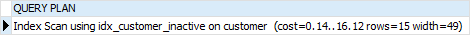
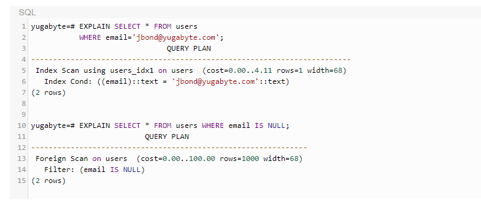

# Index in Postgres and how to use it

# Why is index importance?

Assuming that you need to look up for John Doe’s phone number on a phone book. With the understanding that names on the phone book are in alphabetically order, you first look for the page where the last name is Doe, then look for first name John, and finally get his phone number.

Suppose the names on the phone book were not ordered alphabetically, you would have to go through all pages, check every name until you find John Doe’s phone number. This is called sequential scan which you go over all entries until you find the one that you are looking for.

Similar to a phonebook, the data stored in the table should be organized in a particular order to speed up various searches. This is why indexes come into play.

# Index Types

## How to create an index using specific type
```
CREATE INDEX index_name 
ON table_name [USING method] (indexed_column);
```
## B-tree indexes

B-tree is a self-balancing tree that maintains sorted data and allows searches, insertions, deletions, and sequential access in logarithmic time.

PostgreSQL query planner will consider using a B-tree index whenever index columns are involved in a comparison that uses one of the following operators:

```
<
<=
=
>=
BETWEEN
IN
IS NULL
IS NOT NULL
```

## Hash indexes

Hash indexes can handle only simple equality comparison (=). It means that whenever an indexed column is involved in a comparison using the equal(=) operator, the query planner will consider using a hash index

## GIN indexes

GIN stands for generalized inverted indexes. It is commonly referred to as GIN.

GIN indexes are most useful when you have multiple values stored in a single column, for example, hstore, array, jsonb, and range types.

## BRIN

BRIN stands for block range indexes. BRIN is much smaller and less costly to maintain in comparison with a B-tree index.

BRIN allows the use of an index on a very large table that would previously be impractical using B-tree without horizontal partitioning.

BRIN is often used on a column that has a linear sort order, for example, the created date column of the sales order table.

## GiST Indexes

GiST stands for Generalized Search Tree. GiST indexes allow a building of general tree structures. GiST indexes are useful in indexing geometric data types and full-text search.

## SP-GiST Indexes

SP-GiST stands for space-partitioned GiST. SP-GiST supports partitioned search trees that facilitate the development of a wide range of different non-balanced data structures.

SP-GiST indexes are most useful for data that has a natural clustering element to it and is also not an equally balanced tree, for example, GIS, multimedia, phone routing, and IP routing.

In this tutorial, you have learned various PostgreSQL index types including B-tree, Hash, BRIN, GiST, and SP-GiST.

# Operator Classes

To understand more deeply about Index Types and why is the planner not taking advantage of your index?

## Example
The following query provides which data types and operator classes does B-Tree support

```
SELECT am.amname AS index_method, opc.opcname AS opclass_name,
opc.opcintype::regtype AS indexed_type, opc.opcdefault AS is_default
FROM pg_am am INNER JOIN pg_opclass opc ON opc.opcmethod = am.oid
WHERE am.amname = 'btree'
ORDER BY index_method, indexed_type, opclass_name;
```


B-Tree against text_ops (aka varchar_ops) doesn’t include the ~~ oper‐
ator (the LIKE operator), so none of your LIKE searches can use an index in the text_ops
opclass. If you plan on doing many wildcard searches on varchar or text columns,
you’d be better off explicitly choosing the text_pattern_ops/varchar_pattern_ops
opclass for your index.

To specify the opclass, just append the opclass after the column
name, as in:

```
CREATE INDEX idx1 ON census.lu_tracts USING btree (tract_name text_pattern_ops);
```

# Index On Expression(Functional Indexes)

Normally, you create an index that references one or more columns of a table. But you can also create an index based on an expression that involves table columns. This index is called an index on expression.

The indexes on expressions are also known as functional-based indexes.

The syntax for creating an index on expression is as follows:

```
CREATE INDEX index_name 
ON table_name (expression);
```
Once you define an index expression, PostgreSQL will consider using that index when the expression that defines the index appears in the WHERE clause or in the ORDER BY clause of the SQL statement.

## Example
We have this table


When executing this query, PostgreSQL uses the idx_last_name index as shown in the following EXPLAIN statement:

```
EXPLAIN
SELECT 
    customer_id, 
    first_name, 
    last_name 
FROM 
    customer 
WHERE 
    last_name = 'Purdy';
```


The following statement that finds customers whose last name is purdy in lowercase. However, PostgreSQL could not utilize the index for lookup:

```
EXPLAIN
SELECT 
    customer_id, 
    first_name, 
    last_name 
FROM 
    customer 
WHERE 
    LOWER(last_name) = 'purdy';
```


To improve this query, you can define an index expression like this:

```
CREATE INDEX idx_ic_last_name
ON customer(LOWER(last_name));
```

Now, the query that finds customers based on the last name in a case-insensitive manner will use the index on expression as shown below:

```
EXPLAIN
SELECT 
    customer_id, 
    first_name, 
    last_name 
FROM 
    customer 
WHERE 
    LOWER(last_name) = 'purdy';
```


# Partial Indexes

The partial index is useful in case you have commonly used WHERE conditions which use constant values as follows:

```
SELECT * 
FROM table_name
WHERE column_name = constant_value;
```

## Example
We have this table


```
EXPLAIN SELECT
    customer_id,
    first_name,
    last_name,
    email
FROM
    customer
WHERE
    active = 0;
```


You can optimize this query by creating an index for the active column as follows:

```
CREATE INDEX idx_customer_active
ON customer(active);
```

This index fulfills its purpose, however, it includes many rows that are never searched, namely all the active customers.

To define an index that includes only inactive customers, you use the following statement:

```
CREATE INDEX idx_customer_inactive
ON customer(active)
WHERE active = 0;
```

From now on, PostgreSQL will consider the partial index whenever the WHERE clause appears in a query:

```
EXPLAIN SELECT
    customer_id,
    first_name,
    last_name,
    email
FROM
    customer
WHERE
    active = 0;
```



The syntax for defining a partial index is quite straightforward:

```
CREATE INDEX index_name
ON table_name(column_list)
WHERE condition;
```

# UNIQUE Index

The PostgreSQL UNIQUE index enforces the uniqueness of values in one or multiple columns. To create a UNIQUE index, you can use the following syntax:

```
CREATE UNIQUE INDEX index_name
ON table_name(column_name, [...]);
```

Note that only B-tree indexes can be declared as unique indexes.

When you define an `UNIQUE` index for a column, the column cannot store multiple rows with the same values.

If you define a `UNIQUE` index for two or more columns, the combined values in these columns cannot be duplicated in multiple rows.

PostgreSQL treats `NULL` as distinct value, therefore, you can have multiple `NULL` values in a column with a `UNIQUE` index.

When you define a primary key or a unique constraint for a table, PostgreSQL automatically creates a corresponding UNIQUE index.

# Multicolumn Indexes

You can create an index on more than one column of a table. This index is called a multicolumn index, a composite index, a combined index, or a concatenated index.

The following syntax shows how to create a multicolumn index:

```
CREATE INDEX index_name
ON table_name(a,b,c,...);
```

When defining a multicolumn index, you should place the columns which are often used in the `WHERE` clause at the beginning of the column list and the columns that are less frequently used in the condition after.

In the above syntax, the PostgreSQL optimizer will consider using the index in the following cases:

```
WHERE a = v1 and b = v2 and c = v3;
```

Or

```
WHERE a = v1 and b = v2;
```

Or

```
WHERE a = v1;
```

However, it will not consider using the index in the following cases:

```
WHERE  c = v3;
```

or

```
WHERE b = v2 and c = v3;    
```

# Partial vs Expression Indexes

Let us assume we have a table in PostgreSQL named users, where each row in the table represents a user. The table is defined as follows.

```
CREATE TABLE users (
  id    SERIAL PRIMARY KEY,
  email VARCHAR DEFAULT NULL,
  name  VARCHAR
);
```
Now, let us assume we create the following indexes on the table above.


## Partial Indexes

Consider the first index in our example.

```
CREATE UNIQUE INDEX users_idx1 
  ON users (email) 
  WHERE email IS NOT NULL;
```

This is a partial unique index that:

* Only indexes users whose email is not NULL.
* Ensures that no two users have the same, non-null email address.

Hence, with this index, the table can have any number of users without an email address. But if an email address for a user is specified, then another user cannot already have the same email address. This can be seen from the following examples.


Further, the index `users_idx1` is used when a lookup is performed by a non-empty `email`, while a full-scan is performed if the query looks up users that have a `NULL` value for their email.



## Expression Indexes

```
CREATE UNIQUE INDEX users_idx2
  ON users 
  (( email IS NOT NULL ));
```

The index table in the above case would contain the result of evaluating the expression, `( email IS NOT NULL )`. The result would evaluate to either `true` or `false`, and would allow exactly one row of each kind since it is a `UNIQUE` index. This means that the above index allows only two rows in the table, one row with `email` being `NULL` and the other row with a `non-NULL email`.

While this particular index is not very useful in practice, it certainly illustrates how expression indexes would work. Below are some example rows being inserted into the table.


A more useful example of an expression index in our scenario is to create a case-insensitive index as follows.


This would prevent inserting duplicate email addresses using a different case, as shown in the example below.


# Getting The Most Out Of Your PostgreSQL Indexes

## Eliminate Duplicate Indexes

Over time indexes accumulate, and sometimes one gets added which has the exact same definition as another one. You can use the catalog view pg_indexes to get the human-readable SQL definitions of indexes. You can also easily detect identical definitions:

```
  SELECT array_agg(indexname) AS indexes, replace(indexdef, indexname, '') AS defn
    FROM pg_indexes
GROUP BY defn
  HAVING count(*) > 1;
```
## Unused Indexes

As the applications that use the database evolve, so do the queries that they use. Indexes that were added earlier may no longer be used by any query. Everytime an index is scanned, it is noted by the statistics manager and a cumulative count is available in the system catalog view pg_stat_user_indexes as the value idx_scan. Monitoring this value over a period of time (say, a month) gives a good idea of which indexes are unused and can be removed.

Here is the query to get the current scan counts for all indexes in the ‘public’ schema:

```
SELECT relname, indexrelname, idx_scan
FROM   pg_catalog.pg_stat_user_indexes
WHERE  schemaname = 'public';
```
