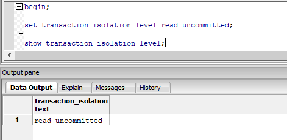

# Isolation levels and Read phenomena PostgreSQL

# 4 read phenomena


Here are some read phenomena that might occurs if a database is running at a low level of transaction isolation:

* First, `dirty read` phenomenon. It happens when a transaction reads data written by other concurrent transaction that has not been committed yet. This is terribly bad, because we don’t know if that other transaction will eventually be committed or rolled back. So we might end up using incorrect data in case rollback occurs.
* The second phenomenon we might encounter is `non-repeatable read`. When a transaction reads the same record twice and see different values, because the row has been modified by other transaction that was committed after the first read.
* `Phantom read` is a similar phenomenon, but affects queries that search for multiple rows instead of one. In this case, the same query is re-executed, but a different set of rows is returned, due to some changes made by other recently-committed transactions, such as inserting new rows or deleting existing rows which happen to satisfy the search condition of current transaction’s query.
* Another phenomenon that involves the separation of a group of transactions is `serialization anomaly`. The result of successfully committing a group of transactions is inconsistent with all possible orderings of running those transactions one at a time.

# 4 isolation levels

Now in order to deal with these phenomena, 4 standard isolation levels were defined by the American National Standard Institute or ANSI.


* The lowest isolation level is `read uncommitted`. Transactions in this level can see data written by other uncommitted transactions, thus allowing dirty read phenomenon to happen.
* The next isolation level is `read committed`, where transactions can only see data that has been committed by other transactions. Because of this, dirty read is no longer possible.
* A bit more strict is the `repeatable read` isolation level. It ensures that the same select query will always return the same result, no matter how many times it is executed, even if some other concurrent transactions have committed new changes that satisfy the query.
* Finally the highest isolation level is `serializable`. Concurrent transactions running in this level are guaranteed to be able to yield the same result as if they’re executed sequentially in some order, one after another without overlapping. So basically it means that there exists at least 1 way to order these concurrent transactions so that if we run them one by one, the final result will be the same.

# Isolation levels in Postgres

Assuming we have a table with the following specification.

```
CREATE TABLE accounts
(
  id serial NOT NULL,
  owner character varying,
  balance integer,
  CONSTRAINT account_pkey PRIMARY KEY (id)
)
```

These are the existing data


## Get current isolation level in Postgres
In postgres, to get the current isolation level, we run this command:

```
show transaction isolation level;
```


By default, it is `read committed`.

## Change isolation level in Postgres

In Postgres, we can only set the isolation level within the transaction, and it will only have effects on that 1 specific transaction.

```
begin;

set transaction isolation level read uncommitted;
```

Now if we show transaction isolation level, we can see that it has been changed to read uncommitted.

```
show transaction isolation level;
```



## Read uncommitted isolation level in Postgres

First, let’s start 2 PostgreSQL consoles on these 2 terminal windows.

Let’s begin the `transaction 1(Tx1)` and `transaction 2 (Tx2)`, and set its isolation level to read uncommitted.


OK, now in `transaction 1`, let’s select all accounts.

```
-- Tx1:
select * from accounts;
```


At the moment, there are 3 accounts with the same balance of 100 dollars. In `transaction 2`, let’s select only account with ID 1.

```
-- Tx2:
select * from accounts where id = 1;
```


Then go back to `transaction 1` and update its balance.

```
-- Tx1:
update accounts set balance = balance - 10 where id = 1 returning *;
```


The balance of account 1 has been changed to 90 dollar here. Now we select that account again in `transaction 2`:

```
-- Tx2:
select * from accounts where id = 1;
```


Strangely, it’s still 100 dollars! This is unexpected, because we’re using `read-uncommitted` level, so `transaction 2` should be able to see uncommitted data of `transaction 1`, right?

Well, in fact, if we look at the [documentation of Postgres](https://www.postgresql.org/docs/current/transaction-iso.html), we can see that `read uncommitted` in Postgres behaves exactly the same as `read committed`.

So basically, we can say that Postgres only have 3 isolation levels, and the lowest level is `read committed`. It makes sense because normally we would never want to use `read uncommitted` in any circumstances.

OK, so let’s go ahead and commit `transaction 1`. Then select account 1 in `transaction 2` one more time.

```
-- Tx1:
commit;
```

```
-- Tx2:
select * from accounts where id = 1;
```


Now it sees the committed balance: 90 dollars, as expected.

Alright, let’s commit this transaction and move to the next isolation level.

```
-- Tx2:
commit;
```

## Read committed isolation level in Postgres

I’m gonna start 2 new transactions, and set their isolation level to `read committed`:

```
-- Tx1 + Tx2:
begin;

set transaction isolation level read committed;

show transaction isolation level;
```


Now just like before, let’s select all accounts in `transaction 1`, then select just account 1 in `transaction 2`.


```
-- Tx1:
select * from accounts;
```


```
-- Tx2:
select * from accounts where id = 1;
```


```
-- Tx2:
select * from accounts where balance >= 90;
```


Beside dirty read phenomenon, we also want to see how it handle phantom read, so let’s find all accounts where balance is greater than or equal to 90 dollars. At the moment, all 3 records satisfy this search condition.

Now let’s go back to `transaction 1` and subtract 10 dollars from account 1’s balance.

```
-- Tx1:
update accounts set balance = balance - 10 where id = 1 returning *;
```


```
-- Tx2:
select * from accounts where id = 1;
```


If we select account 1 in `transaction 2`, it will still be 90 dollars because `transaction 1` is not committed yet. So dirty read is not possible in `read-committed` isolation level.

Let’s see what happen if we commit `transaction 1`.

```
-- Tx1:
commit;
```

```
-- Tx2:
select * from accounts where id = 1;
```


This time `transaction 2` can see the updated balance of 80 dollars.

So the same query that get account 1 returns different value. This is `non-repeatable read` phenomenon.

Now if we run the query to search for accounts with at least 90 dollars again, we will only see 2 records instead of 3 as before.

```
-- Tx2:
select * from accounts where balance >= 90;
```


This time we only get 2 records instead of 3 as before, because the balance of account 1 has decreased to 80 after transaction 1 was committed.

The same query was executed, but a different set of rows is returned. One row has disappeared due to other committed transaction. This is called `phantom-read` phenomenon.

So now we know that `read-committed` isolation level can only prevent dirty read, but still allows `non-repeatable read` and `phantom-read` phenomena.

Let’s commit this transaction and move up 1 level.

```
-- Tx2:
commit;
```

## Repeatable read isolation level in Postgres

I’m gonna begin 2 new transactions, then set their transaction isolation level to `repeatable read`.

```
-- Tx1 + Tx2:
begin;

set transaction isolation level repeatable read;

show transaction isolation level;
```


Alright, now let’s select all accounts in `transaction 1`, then select just account with ID 1 in `transaction 2`. Also search for the accounts with balance of at least 80 dollars.

```
-- Tx1:
select * from accounts;
```


```
-- Tx2:
select * from accounts where id = 1;
```


```
-- Tx2:
select * from accounts where balance >= 80;
```


Now go back to `transaction 1` and subtract 10 more dollars from its balance.

```
-- Tx1:
update accounts set balance = balance - 10 where id = 1 returning *;
```


The balance has been updated to 70 dollars in this transaction. Let’s commit it and see what will happen in `transaction 2`.

```
-- Tx1:
commit;
```

```
-- Tx2:
select * from accounts where id = 1;
```


Now if we select account 1 in `transaction 2`, it’s still 80 dollars as before, although `transaction 1` has committed its change.

That’s because we’re using repeatable read isolation level, so the same select query should always return the same result. `Non-repeatable read` phenomenon cannot happen in this case.

Also, if we rerun the query to search for accounts with at least 80 dollars:

```
-- Tx2:
select * from accounts where balance >= 80;
```


We still get the same 3 records as before. So `phantom read` is also prevented in this `repeatable read` isolation level.

Now I’m gonna try to run this update account balance query to see how it behaves:

```
-- Tx2:
update accounts set balance = balance - 10 where id = 1 returning *;
```


We’ve got an error:

```
ERROR: could not serialize access due to concurrent update
```

Let's rollback `transaction 2 `and move up a level

```
-- Tx2:
rollback;
```

## Serialization anomaly in Postgres

Until now we have encountered 3 types of phenomena: `dirty read`, `non-repeatable read`, and `phantom read`. But we haven’t run into `serialization anomaly` yet. So this time, let’s see how it’s gonna look like.

Let’s start 2 new transactions, and set their isolation level to `repeatable-read`.

```
-- Tx1 + Tx2:
begin;

set transaction isolation level repeatable read;

show transaction isolation level;
```


Then in `transaction 1`, let’s select all accounts record.

```
-- Tx1:
select * from accounts ORDER BY id;
```


Now imagine that we have a use-case, where we have to compute the sum of all accounts’ balance then create a new account with that total balance.

So let’s run this command this `transaction 1`:

```
-- Tx1:
select sum(balance) from accounts;
```


It's 270 dollars. Then we insert into accounts table a new record, where `owner` is "sum", `balance` is 270.

```
-- Tx1:
insert into accounts(owner, balance) values ('sum', 270) returning *; 
```


```
-- Tx1:
select * from accounts ORDER BY id;
```


OK now we can see the new record in this `transaction 1`. However, what if `transaction 2` also wants to perform this operation?

Since we’re using `repeatable-read` isolation level, the select query in `transaction 2` will only see the original list of accounts, without the new record that `transaction 1` has just inserted.

```
-- Tx2:
select * from accounts ORDER BY id;
```


```
-- Tx2:
select sum(balance) from accounts;
```


```
-- Tx2:
insert into accounts(owner, balance) values ('sum', 270) returning *; 
```


Therefore, it will get the same value for the sum of accounts balance, 270 dollars. And thus, end up inserting the same record to the accounts table.

OK now let’s commit both transactions to see what will happen.

```
-- Tx1:
commit;
```

```
-- Tx2:
commit;
```

```
select * from accounts ORDER BY id;
```


They were both committed successfully. And there are 2 duplicate sum records with the same balance of 270 dollars.

This is a serialization anomaly!

Why?

Because if these 2 transactions are run serially, one after another, then there’s no way we can have 2 records with the same sum of 270 like that.

It doesn’t matter if transaction 1 or transaction 2 runs first, we should have 1 record of 270 dollars, and another record of 540 dollars.

OK so that’s how `serialization anomaly` occurs in `repeatable-read` isolation level.

Now let’s try the highest level: `serializable` to see if this anomaly can be stopped or not.

## Serializable isolation level in Postgres

I’m gonna start 2 new transactions, then set their isolation level to `serializable`.

```
-- Tx1 + Tx2:
begin;

set transaction isolation level serializable;

show transaction isolation level;
```


Now let’s select all accounts in` transaction 1`, calculate the sum of all balances, and insert a new account with balance equals to this sum.

```
-- Tx1:
select * from accounts ORDER BY id;
```


```
-- Tx1:
select sum(balance) from accounts;
```


```
-- Tx1:
insert into accounts(owner, balance) values ('sum', 810) returning *; 
```


```
-- Tx1:
select * from accounts ORDER BY id;
```


Now as you can see, a new sum record of 810 dollars has been inserted in `transaction 1`. Let’s go to `transaction 2` and run the same series of query.


```
-- Tx2:
select * from accounts ORDER BY id;
```


```
-- Tx2:
select sum(balance) from accounts;
```


```
-- Tx2:
insert into accounts(owner, balance) values ('sum', 810) returning *; 
```


```
-- Tx2:
select * from accounts ORDER BY id;
```


After this select query, we can see that the list of accounts in both transactions are almost identical (except the ID).

Let’s try to commit both of them.

```
-- Tx1:
commit;
```


```
-- Tx2:
commit;
```


```
ERROR:  could not serialize access due to read/write dependencies among transactions
DETAIL:  Reason code: Canceled on identification as a pivot, during commit attempt.
HINT:  The transaction might succeed if retried.
```

The `transaction 1` is committed successfully. However, the `transaction 2` throws an error:

```
ERROR: could not serialize access due to read/write dependencies among transactions
```

And Postgres gives us a hint that the transaction might succeed if we retry it.

So this is good! The `serializable anomaly` is completely prevented. The 2 concurrent transactions no longer create duplicate records like they did before.

We can conclude that Postgres uses a `dependencies detection` mechanism to detect potential `read phenomena` and stop them by throwing out an error.


# More on READ COMMITTED anomalies in PostgreSQL

Assuming we have a table with the following specification.

These are the existing data


In `Session 1`, you start a transaction to change "x" to the opposite, and adding 100 to "y" to see that the update took place:

```
-- Session 1
begin;
update t set x=-x, y=y+100;
select * from t;
```


Now, keeping this transaction opened, on `Session 2`, you update "y" for the negative value only:

```
-- Session 2
update t set y=y+1000 where x<0;
```

Of course it is waiting on `Session 1` to see if the update to the opposite is committed or not. So you go back to `Session 1` and commit the transaction:

```
-- Session 1
commit;
```

What do you expect in `Session 2`?

In `READ COMMITTED`, you see a snapshot of committed changes only. At the time the query started, this is what was committed:


But Postgres cannot update a past snapshot and this is why it waited for the other transaction. Then, as this other transaction has committed its changes, the update should be done on:


And, in both cases, anyway, there is always one row that is negative. The set x=-x from the first session is atomic. There will always be one row negative and one positive. I expect my Session 2 to update one row and only one row.

But this is not what you observe, right?


No rows updated. What happened is that the first row that has been read by the update, in `READ COMMITTED` mode, was the "x"=+1 and then not updated. Then the second row is read, with the "x"=-1 that verifies the where clause. However, at the time of updating the current value, when the lock was acquired, it was then "x"=+1 and has been ignored by PostgreSQL. Basically, PostgreSQL ignored the atomicity of the concurrent update when verifying the WHERE predicate. And worse: this depends on the physical order the rows are processed.

As we don't have this automatic DML restart in PostgreSQL, avoiding this anomaly means increasing the isolation level. Then, when the conflict is detected, the application has to retry the statement. If you use `READ COMMITTED`, these anomalies are just ignored. `READ COMMITTED` is tempting, as there is no need to implement a retry logic, but hard to scale and dangerous on write conflicts.